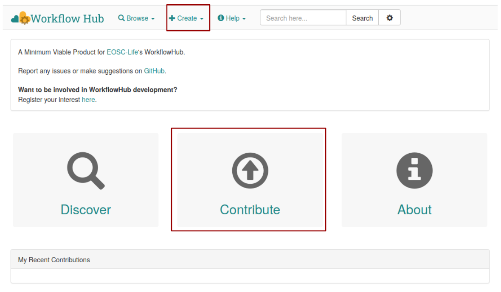

### Prerequisites

Before you register a workflow, you need to ensure that you
* are [logged into](../Logging-in) the workflowhub
* you are part of a project
* know the type of the workflow
* have decided which [projects](./Browsing-projects) to assign the workflow to

### Get started

To create a workflow, you can either click on the "contribute" icon in the WorkflowHub homepage, or in the "Workflow" option of the "Create" menu from any page of the application.

### Supported workflow types

Following workflow types are tested to work well with Workflow Hub
* Common Workflow Language (CWL)
* Nextflow (.nf)
* Galaxy (.ga)
* SnakeMake (.snake)
* KNIME (.knwf)

It is also possible to upload workflows from another type (for ex. bash scripts), these will be recognized as unknown workflow type. Note that at this moment only for CWL workflows it is possible to automatically generate a diagram.

### Registering a workflow

After clicking on the "Contribute" icon or selecting "Create" and then "Workflow" from the navigation menu bar, you have 3 options for registering your workflow:
* [By registering an existing Workflow RO Crate](../Registering-an-existing-Workflow-RO-Crate)\
  When you have created the workflow RO crate yourself, and want to upload it "as is".
* [By registering a workflow, along with a diagram and abstract CWL](../Registering-a-workflow-with-a-diagram-and-abstract-CWL) \
  When you not only have a workflow file, but also a CWL abstract and/or a diagram you want to upload
* [By registering just a workflow](../Registering-just-a-workflow) \
  Use this option when your starting point is only a workflow file or a reference to a workflow.

For more information on the upload options, please go to the corresponding pages.
