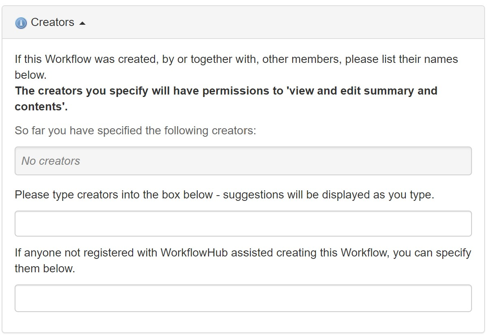

This option allows you to upload a workflow along with optionally a diagram and/ or an abstract CWL. 

## Uploading the files

### 1. The main workflow file

This is the main workflow file that has to be uploaded. Note that in this option it is not possible to reference towards a workflow, this feature is only available at this moment in the [Registering just a workflow](./Registering-just-a-workflow) option. Specify the `Workflow type` of the main workflow. If your workflow is not listed, please choose *other*.

### 2. The CWL abstract (optional)

The CWL abstract is used as a summary of the workflow to parse Inputs, Steps, Outputs and the description (doc) if provided.
If you have a Galaxy workflow you can generate the CWL abstract with 
[galaxy2cwl](https://github.com/workflowhub-eu/galaxy2cwl). This can be advantageous if you want to automatically generate a diagram for your workflow. Other workflow types will be supported soon. If your main workflow is a CWL workflow,  you can skip this step.

### 3. The diagram (optional)

The diagram can be generated out of the CWL abstract by the Workflow Hub website if provided, or can be an .svg (preferred) or most other image filetypes (.jpeg/.png).

### 4. Upload the files

Click upload.

## Filling in the metadata

The next page is basically a form to gather the necessary meta data that will be inclosed in the RO-crate.

### The fields:
- **Title\***: This field is mandatory 

- **Description**: If a CWL (abstract) file is given, the description will be parsed automatically out of the `doc` attribute. In any other case this field can be used to write some documentation that will be showed on the workflow page

- **Projects\***: Every workflow registration is linked to one or more projects. If you can not select the correct project, please go to [Joining a project](./How-to-join-a-project).

- **License**: The standard license is [Apache Software License 2.0](https://opensource.org/licenses/Apache-2.0). If you did not make the workflow yourself, be sure that the license corresponds to the license where you took the workflow from (for example [github licenses](https://help.github.com/en/github/creating-cloning-and-archiving-repositories/licensing-a-repository) )

- **Sharing**: Specify who can view the summary, get access to the content, and edit the Workflow. This is possibly already filled in according to the selected project.

- **Tags**: Choose an appropriate tag for your workflow. Please check if your tag is already available and use the existing one if so. If you make a new tag, keep it simple without capitals or spaces. For example all new covid-19 workflows will be tagged with `covid-19`.

- **Creators**: This is an important section where all the people that where involved in making/publishing this workflow are listed. These creators will be added to the metadata in the RO-crate. 
    3 sections are used to specify the contributors or creators of the workflow.

    1. **So far you have specified the following creators**\
    This is by default filled in with *No creators*.
    
    2. **Please type creators into the box below - suggestions will be displayed as you type.**\
    If the creators or contributors to the workflow are registered in workflow hub, please use this field to search and select them.                   
    
    3. **If anyone not registered with WorkflowHub assisted creating this Workflow, you can specify them below.**\
    Use this field to fill in the remaining creators.
    

##  Check the uploaded workflow

